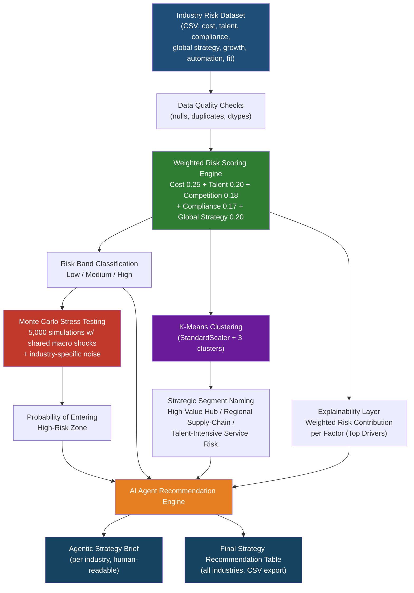

# 🇸🇬 Singapore MNC Risk & Strategy AI Agent

**An agentic ML decision-support system that analyses risk and recommends strategy for multinational companies (MNCs) operating in Singapore.**

[](https://www.python.org/)
[](https://scikit-learn.org/)
[](https://pandas.pydata.org/)
[](LICENSE)

---

## 📌 Overview

Should a multinational company keep Singapore as a strategic hub, scale routine operations here, or shift work to lower-cost regional locations? This project builds an **agentic ML decision-support system** that answers that question quantitatively — combining weighted risk scoring, unsupervised ML segmentation, Monte Carlo stress testing, explainability, and rule-based agentic recommendation logic.

The system evaluates each industry across eight dimensions:

- Cost pressure
- Talent & labour risk
- Competition & growth risk
- Regulation & compliance risk
- Global strategy risk
- Growth potential
- Automation readiness
- Regional expansion fit

...and produces a final, explainable strategic recommendation: **stay as a high-value hub, scale selectively, expand regionally, or stabilise before growth.**

---

## 🏗️ Architecture



**Pipeline in one line:** `Risk Dataset → Weighted Scoring → K-Means Segmentation → Monte Carlo Stress Test → Explainability → Agentic Recommendation Engine → Strategy Report`

---

## 🧠 How the Agent "Thinks"

The recommendation engine follows a tool-based agentic workflow rather than a single static rule:

1. **Read** the selected industry's risk profile
2. **Calculate** its weighted risk score and risk band
3. **Identify** its strategic segment (from K-Means clustering)
4. **Review** its Monte Carlo stress-test exposure (probability of turning high-risk)
5. **Identify** its top risk drivers (explainability)
6. **Generate** a recommended action plan grounded in steps 1–5

This chain of reasoning — read → score → segment → stress-test → explain → recommend — is what makes it an *agentic* decision-support system rather than a static dashboard.

---

## 📊 Key Components

| Stage | Technique | Purpose |
|---|---|---|
| Risk Scoring | Weighted linear scoring model | Converts 5 raw risk dimensions into a single 0–100 risk score & band |
| Segmentation | K-Means (unsupervised ML) | Groups industries into strategic archetypes based on 8 features |
| Stress Testing | Monte Carlo simulation (5,000 runs) | Estimates probability of an industry crossing into high-risk territory under future shocks |
| Explainability | Weighted contribution breakdown | Shows *why* a score is high — which factor drives it (avoids black-box ML) |
| Recommendation | Rule-based agentic engine | Converts all of the above into a plain-English strategic action plan |

---

## 🔑 Key Findings

- **Finance & fintech** shows the highest risk — driven by cost pressure, talent competition, and strict compliance requirements — and also carries the highest probability (~69%) of remaining/worsening into high-risk territory under stress.
- **Advanced manufacturing** enters the high-risk zone due to high operating costs and global supply-chain exposure (~51% stress probability).
- **Technology & AI services** has medium risk but the highest growth potential and automation readiness, with only an ~12% probability of turning high-risk — making it the strongest candidate for selective scaling.
- **Logistics & supply chain** is most exposed to global-strategy and supply-chain risk specifically, despite strong regional expansion fit.
- Overall, Singapore remains highly attractive as a **hub for headquarters, regional leadership, finance, innovation, and compliance functions** — but not always the most cost-effective location to scale **routine, cost-sensitive operations**, which are better suited to regional shared-service centres.

---

## 🛠️ Tech Stack

- **Python 3** — pandas, numpy
- **Visualization** — matplotlib, seaborn
- **Machine Learning** — scikit-learn (StandardScaler, KMeans)
- **Simulation** — NumPy-based Monte Carlo stress testing
- **Reasoning/Recommendation** — rule-based agentic logic (Python)

---

## 📁 Repository Structure

```
singapore-mnc-risk-strategy-ai-agent/
│
├── singapore-mnc-risk-strategy-ai-agent.ipynb   # Full analysis notebook
├── singapore_mnc_risk_profiles.csv              # Input dataset
├── final_singapore_mnc_strategy_recommendations.csv  # Final output table
├── README.md
└── assets/
    └── architecture_diagram.png (optional export of the Mermaid diagram above)
```

---

## ▶️ How to Run

```bash
git clone https://github.com/sharmi1991/singapore-mnc-risk-strategy-ai-agent.git
cd singapore-mnc-risk-strategy-ai-agent
pip install pandas numpy matplotlib seaborn scikit-learn
jupyter notebook singapore-mnc-risk-strategy-ai-agent.ipynb
```

Run all cells top to bottom. The notebook will regenerate the dataset, risk scores, clusters, stress-test results, and the final strategy recommendation table (`final_singapore_mnc_strategy_recommendations.csv`).

To generate a strategy brief for a specific industry:

```python
agentic_strategy_brief("Technology and AI services")
```

---

## 🔮 Future Scope

- Replace the curated CSV with **live data** from MTI, MOM, EDB, MAS, and SingStat
- Pull macroeconomic indicators from **World Bank, IMF, OECD** APIs
- Add **real-time news sentiment analysis** for geopolitical and supply-chain risk
- **LLM-based board report generation** (Gemini / OpenAI) from the agent's structured output
- **SHAP explainability** once a larger labelled dataset is available
- Deploy as an interactive **Streamlit** or **Hugging Face Spaces** app

---

## 📝 Resume Bullet

> Built an agentic ML decision-support system for Singapore MNC risk strategy, combining weighted risk scoring, K-Means segmentation, Monte Carlo stress testing, explainability, and policy-aware recommendations to identify high-value hub, regional scale-out, and cost-stabilisation strategies.

---

## 👤 Author

**Sharmi J**
- GitHub: [github.com/sharmi1991](https://github.com/sharmi1991)
- LinkedIn: [linkedin.com/in/sharmi-j-188622245](https://linkedin.com/in/sharmi-j-188622245)

---

## 📄 License

This project is available under the MIT License. Feel free to fork, adapt, and build on it.
