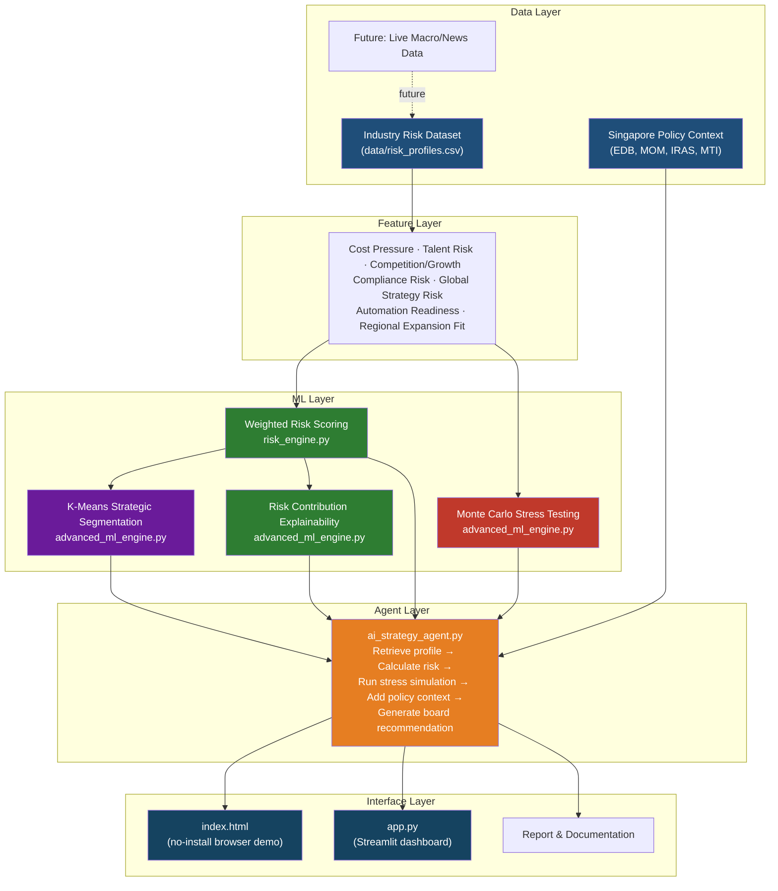

# Singapore MNC Risk & Strategy AI Agent

**An agentic ML decision-support system that analyses risk and recommends strategy for multinational companies (MNCs) operating in Singapore.**

[](https://www.python.org/)
[](https://scikit-learn.org/)
[](https://streamlit.io/)
[](LICENSE)

---

## 📌 Overview

Should a multinational company keep Singapore as a strategic hub, scale routine operations here, or shift work to lower-cost regional locations? This project answers that question with a working **agentic ML decision-support system** — not just a static dashboard.

It combines:

- Business risk analytics
- Machine-learning-style strategic segmentation (K-Means)
- Monte Carlo stress testing
- Contribution-based explainability
- Policy-aware strategy recommendation
- An AI-agent tool-orchestration workflow

The system evaluates each industry across eight dimensions — cost pressure, talent & labour risk, competition & growth risk, regulation & compliance risk, global strategy risk, growth potential, automation readiness, and regional expansion fit — and produces a final, explainable recommendation: **stay as a high-value hub, scale selectively, expand regionally, or stabilise before growth.**

### Why this is stronger than a simple dashboard

A simple dashboard only displays data. This project makes decisions:

1. Scores risk using transparent, weighted rules.
2. Groups industries into strategic segments with K-Means.
3. Simulates uncertainty through Monte Carlo stress testing.
4. Explains which factors drive each risk score.
5. Uses an agent workflow to combine data, policy context, model output, and recommendations into a board-ready brief.

---

## 🌐 Live Demo

| Version | Link |
|---|---|
| 🖥️ Browser (no install) | [View on GitHub Pages](https://sharmi1991.github.io/singapore-mnc-risk-strategy-ai-agent/) |
| ⚙️ Streamlit app | [Open Streamlit App](https://singapore-mnc-risk-agent.streamlit.app/) |

Both versions are live — try selecting different industries to see the risk score, strategic segment, and recommendation update in real time.

---

## 🏗️ Architecture



**Pipeline in one line:** `Risk Dataset + Policy Context → Weighted Scoring → K-Means Segmentation → Monte Carlo Stress Test → Explainability → AI Agent → Board Brief (browser / Streamlit / CLI)`

---

## 🧠 How the Agent "Thinks"

`ai_strategy_agent.py` follows a tool-based agentic workflow rather than a single static rule:

1. **Retrieve** the selected industry's risk profile
2. **Calculate** its weighted risk score and risk band
3. **Identify** its strategic segment (from K-Means clustering)
4. **Run** its Monte Carlo stress simulation (probability of turning high-risk)
5. **Add** current Singapore policy context (EDB, MOM, IRAS, MTI)
6. **Generate** a board-ready recommendation grounded in steps 1–5

This chain of reasoning — retrieve → score → segment → stress-test → contextualise → recommend — is what makes it an *agentic* decision-support system rather than a static dashboard.

---

## 📊 Key Components

| Layer | File | Technique | Purpose |
|---|---|---|---|
| Scoring | `risk_engine.py` | Weighted linear scoring model | Converts 5 raw risk dimensions into a single 0–100 risk score & band |
| Segmentation | `advanced_ml_engine.py` | K-Means (unsupervised ML) | Groups industries into strategic archetypes based on 8 features |
| Stress Testing | `advanced_ml_engine.py` | Monte Carlo simulation (5,000 runs) | Estimates probability of an industry crossing into high-risk territory under future shocks |
| Explainability | `advanced_ml_engine.py` | Weighted contribution breakdown | Shows *why* a score is high — avoids black-box ML |
| Agent | `ai_strategy_agent.py` | Rule-based tool orchestration | Combines all of the above + policy context into a board brief |
| Interface | `index.html`, `app.py` | HTML / Streamlit | No-install browser demo, or interactive Python app |

### Risk Score Formula

```text
Total Risk Score =
Cost Pressure          × 0.25 +
Talent and Labour      × 0.20 +
Competition and Growth × 0.18 +
Regulation/Compliance  × 0.17 +
Global Strategy        × 0.20

Risk bands: Low (< 45)  |  Medium (45–69.9)  |  High (≥ 70)
```

---

## 🔑 Key Findings

- **Finance & fintech** shows the highest risk — driven by cost pressure, talent competition, and strict compliance requirements — and also carries the highest probability (~69%) of remaining/worsening into high-risk territory under stress.
- **Advanced manufacturing** enters the high-risk zone due to high operating costs and global supply-chain exposure (~51% stress probability).
- **Technology & AI services** has medium risk but the highest growth potential and automation readiness, with only an ~12% probability of turning high-risk — the strongest candidate for selective scaling.
- **Logistics & supply chain** is most exposed to global-strategy and supply-chain risk specifically, despite strong regional expansion fit.
- Overall, Singapore remains highly attractive as a **hub for headquarters, regional leadership, finance, innovation, and compliance functions** — but not always the most cost-effective location to scale **routine, cost-sensitive operations**, which are better suited to regional shared-service centres.

---

## Real-Time Singapore Policy Context

The recommendations are grounded in current Singapore policy signals, not just the raw dataset:

- Singapore remains a strong headquarters location because of regional connectivity, talent, trust, and infrastructure.
- Employment Pass eligibility includes qualifying salary and COMPASS, so foreign professional hiring requires planning.
- Refundable Investment Credit (RIC) supports approved high-value activities such as headquarters, centres of excellence, R&D, digital services, and supply-chain management.
- 2026 economic context includes resilient growth but higher geopolitical and external-demand uncertainty.

**Official sources**
- [EDB Singapore Headquarters](https://www.edb.gov.sg/en/our-industries/headquarters.html)
- [MOM Employment Pass Eligibility](https://www.mom.gov.sg/passes-and-permits/employment-pass/eligibility)
- [IRAS Refundable Investment Credit](https://www.iras.gov.sg/schemes/disbursement-schemes/refundable-investment-credit-(ric))
- [MTI 2026 GDP Forecast](https://www.mti.gov.sg/newsroom/mti-maintains-2026-gdp-growth-forecast-at--2-0-to-4-0-per-cent-/)
- [MTI 2Q 2026 Advance Estimates](https://www.mti.gov.sg/newsroom/singapore-s-gdp-grew-by-5-7-per-cent-in-the-second-quarter-of-2026/)

---

## 🛠️ Tech Stack

- **Python 3** — pandas, numpy
- **Machine Learning** — scikit-learn (StandardScaler, KMeans)
- **Simulation** — NumPy-based Monte Carlo stress testing
- **Agent Logic** — rule-based tool orchestration (`ai_strategy_agent.py`)
- **Interfaces** — HTML/JS (no-install demo), Streamlit (interactive app)
- **Visualization** — matplotlib, seaborn (notebook)

---

## 📁 Repository Structure

```
singapore-mnc-risk-strategy-ai-agent/
│
├── index.html                          # No-install interactive dashboard — open directly in a browser
├── app.py                              # Streamlit dashboard (optional, for Python-based demo)
├── risk_engine.py                      # Weighted risk scoring & recommendation logic
├── advanced_ml_engine.py               # K-Means segmentation, Monte Carlo stress testing, explainability
├── ai_strategy_agent.py                # Agent-style workflow — calls project tools, produces board brief
├── data/
│   └── risk_profiles.csv               # Editable industry risk dataset
├── singapore-mnc-risk-strategy-ai-agent.ipynb   # Full research notebook (EDA → ML → agent logic)
├── requirements.txt                    # Python dependencies (Streamlit version)
├── PROJECT_REPORT_OUTLINE.md           # Capstone report structure
├── MODEL_CARD.md                       # ML model purpose, inputs, outputs, limitations, future scope
├── SCIENTIST_LEVEL_UPGRADE_PLAN.md     # Advanced positioning & viva pitch notes
├── .gitignore
└── README.md
```

---

## ▶️ Getting Started

**Install dependencies**

```bash
pip install -r requirements.txt
```

**1. Browser (no installation)**

Open `index.html` directly in any browser.

**2. Command-line agent**

```bash
python ai_strategy_agent.py --industry "Technology and AI services"
```

Prints the agent's tool trace, risk score, Monte Carlo stress result, strategic segment, top risk drivers, and an LLM-ready prompt for board-report generation.

**3. Streamlit app**

```bash
streamlit run app.py
```

**4. Research notebook**

```bash
jupyter notebook singapore-mnc-risk-strategy-ai-agent.ipynb
```

Run all cells top to bottom to reproduce the full EDA, scoring, clustering, stress testing, explainability, and recommendation pipeline.

---

## 📋 Model Card (summary)

- **Intended users:** business analysts, strategy teams, capstone evaluators, students demonstrating applied ML/agent thinking.
- **Inputs:** cost pressure, talent/labour risk, competition/growth risk, regulation/compliance risk, global strategy risk, growth potential, automation readiness, regional expansion fit.
- **Outputs:** total risk score, risk band, strategic segment, high-risk probability under stress, top risk drivers, recommended action plan, board-level brief.
- **Limitations:** the dataset is curated for demonstration (should be replaced with live APIs for production use); risk scores are strategic estimates, not audited financial forecasts; the recommendation engine is transparent and rule-based (an LLM can be layered on top for natural-language board reports).

Full details in [`MODEL_CARD.md`](MODEL_CARD.md).

---

## 🔮 Future Scope

- Replace the curated CSV with **live data** from MTI, MOM, EDB, MAS, and SingStat
- Pull macroeconomic indicators from **World Bank, IMF, OECD** APIs
- Add **real-time news sentiment analysis** for geopolitical and supply-chain risk
- **LLM-based board report generation** (Gemini / OpenAI) from the agent's structured output
- **SHAP explainability** once a larger labelled dataset is available
- Add **interactive scenario sliders** for tariff, salary, rent, and demand shocks
- Add **ASEAN country comparison**
- Deploy `app.py` as a public **Streamlit Cloud** or **Hugging Face Spaces** app

---

## 👤 Author

**Sharmi J**
- GitHub: [github.com/sharmi1991](https://github.com/sharmi1991)
- LinkedIn: [linkedin.com/in/sharmi-j-188622245](https://linkedin.com/in/sharmi-j-188622245)

---

## 📄 License

This project is available under the MIT License. Feel free to fork, adapt, and build on it.

